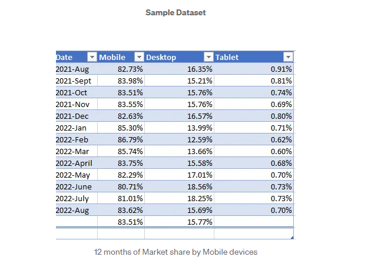
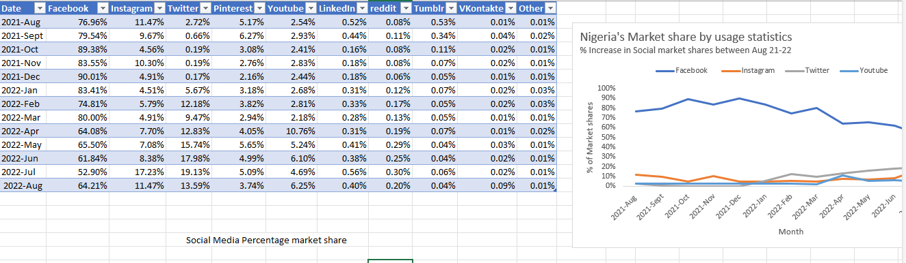
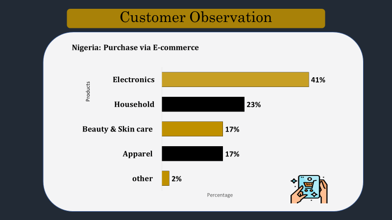
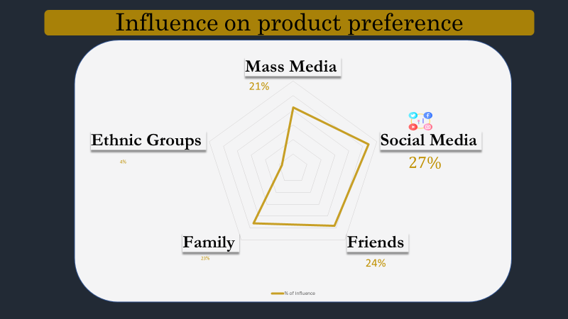
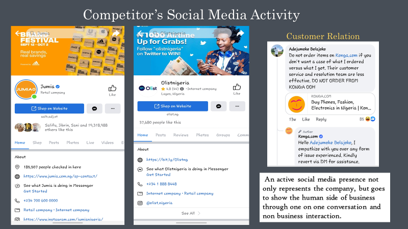
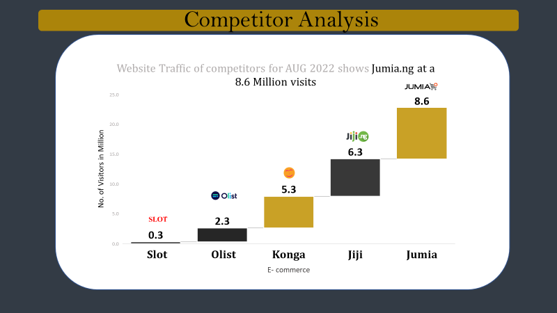
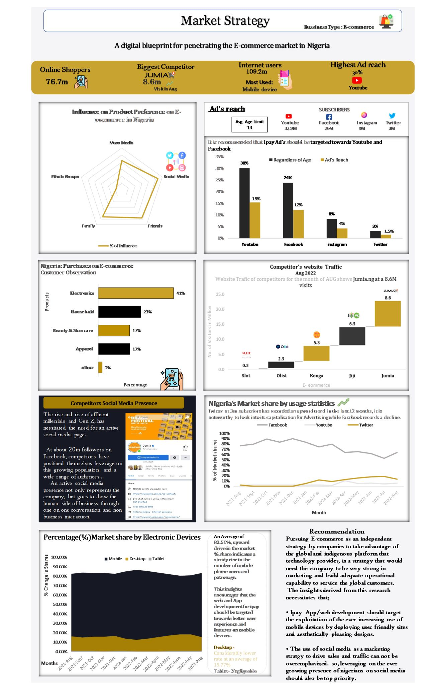

# Ecommerce-Market-Analysis
## Introduction 

This project was born with the overarching objective of aiding prospective e-commerce ventures in penetrating the bustling Nigerian market through the meticulous analysis of customer data and competitor analysis. E-commerce is a rapidly evolving landscape characterized by its potential for intuitive growth and success. Electronic commerce encompasses the digital exchange of goods and services, underpinned by the transfer of funds and data over the Internet.

## Skills Applied:
The ability to decipher data and glean actionable insights is a paramount skill.

Throughout this project, a range of skills were applied and honed. These include: 
- data gathering,
- data transformation,
- analysis, visualization,
- and the formulation of meaningful recommendations.

 _The project leveraged various data sources, including Statista, Datareportal, and Africa Daily, due to the inherent challenge of data scarcity from the Nigerian Bureau of Statistics._
 
## Problem Statement:
The crux of this project lies in addressing a fundamental problem: How can aspiring e-commerce enterprises effectively carve out a niche in the Nigerian market, armed with the knowledge of customer behavior and market competition? To tackle this, data was harnessed to provide answers and actionable strategies.

## Data Transformation:
Data collection proved to be a challenging endeavor, as reliable sources were limited. Nevertheless, data was meticulously gathered from Statista, Datareportal, and Africa Daily. This data formed the backbone of the analysis, allowing for deeper insights into the e-commerce landscape in Nigeria.

A                                 |         B
:--------------------------------:|:----------------------------------:
                    |

## Analysis and Visualization:
---

In the pursuit of understanding the data, extensive analysis was undertaken. The data revealed vital information about purchasing patterns, the primary platforms for transactions, and the driving mechanisms behind sales. 

---
As our data analysis progressed, a significant finding came to light: the pivotal role of social media in the e-commerce landscape. Our data not only pointed to the influence of online platforms in driving sales but also highlighted the untapped potential of social media for reaching and engaging with customers. Visualizing this data revealed a clear trend of customers turning to social platforms for product information, recommendations, and community interaction.

         
 | 
---
Social media has emerged as an unsung hero in the world of e-commerce. It serves not only as a channel to direct shoppers toward new products and attractive deals but, more importantly, as a platform to foster engagement and cultivate a sense of community. This ability to connect with customers on a personal level is an invaluable asset. It not only sets the stage for the creation of a dedicated community of loyal customers but also provides a powerful platform for extending outreach and brand exposure.

A crucial component of the project presented its own challenges. However, Microsoft Excel proved to be a versatile tool, and a color-picker in PowerPoint facilitated adherence to company branding. The result was visually engaging and informative representations of the data

### Competitor Analysis
---

---

## Conclusion and Recommendation
In conclusion, this project illuminated the transformative potential of data-driven decision-making within the realm of e-commerce. It has become abundantly clear that in the dynamic landscape of the Nigerian market, success is not merely about competing; it's about being intuitive. A pivotal finding that underscores this point is the remarkable influence of social media.

Based on our data analysis and the profound impact of social media, the core recommendation stemming from this project is clear: Any e-commerce venture aiming to thrive in Nigeria must fully harness the potential of social media. It is not just a marketing tool; it is the cornerstone of building enduring customer relationships and driving exponential growth. In the era of data and digital connectivity, social media is not an option; it is imperative for sustainable e-commerce success.

It is with utmost confidence and conviction that we emphasize the profound significance of integrating social media strategies into the e-commerce landscape. It is the key to not only surviving but thriving in the Nigerian market, setting the stage for a brighter and more prosperous future in the world of online retail.

 
